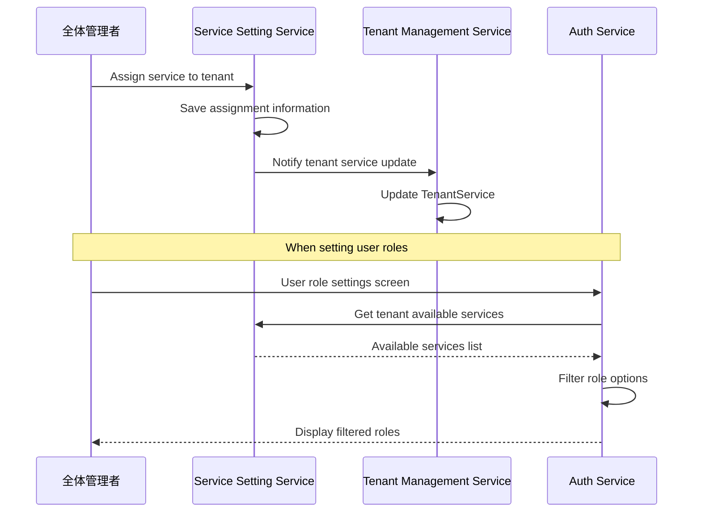

# Service Setting Service (利用サービス設定サービス)

Service Setting Service for ws-demo-poly4 project.

## Overview

This service manages service assignments to tenants. By assigning services to tenants, users within those tenants can utilize the assigned services.

## Features

- Service management (master data)
- Service assignment to tenants
- Role-based access control (全体管理者, 閲覧者)
- Integration with tenant management and authentication services
- FastAPI web framework
- Azure Cosmos DB integration

## Documentation

### Service Documentation
- [Service Specification](./docs/services/service-setting/spec.md) - Complete service specification including user scenarios, API endpoints, and business logic
- [Data Model](./docs/services/service-setting/data-model.md) - Cosmos DB schema and data structure

### Architecture Documentation
- [API Guidelines](./docs/architecture/api-guidelines.md) - REST API design standards
- [Authentication Flow](./docs/architecture/authentication-flow.md) - JWT-based authentication and authorization
- [Database Design](./docs/architecture/database-design.md) - Cosmos DB container design and partition strategy

## Roles

| Role | Description | Permissions |
|------|-------------|-------------|
| 全体管理者 | Full service assignment privileges | Can assign services to tenants |
| 閲覧者 | Read-only | Can only view information |

## Available Services

The system manages assignments for the following services:
- File Management Service (ファイル管理サービス)
- Messaging Service (メッセージングサービス)
- API Service (API利用サービス)
- Backup Service (バックアップサービス)

## Setup

### Prerequisites

- Python 3.11+
- Azure Cosmos DB account
- Docker Desktop (v20.10+) - for Cosmos DB Emulator

### Installation

```bash
# Install dependencies using pip
pip install -r requirements.txt

# Or using poetry
poetry install
```

### Configuration

Copy `.env.example` to `.env` and configure your settings:

```bash
cp .env.example .env
```

Required environment variables:
- `COSMOSDB_ENDPOINT`: Your Cosmos DB endpoint URL
- `COSMOSDB_KEY`: Your Cosmos DB access key
- `COSMOSDB_DATABASE`: Database name (default: management-app)
- `COSMOSDB_CONTAINERS`: Container names for services and service-assignments

## Running the Service

### Development Mode

```bash
# Using uvicorn directly
uvicorn app.main:app --reload --port 8004

# Or using the startup script
python -m app.main
```

### Production Mode

```bash
uvicorn app.main:app --host 0.0.0.0 --port 8004
```

## API Endpoints

Base URL: `http://localhost:8004`

### Health Check
- `GET /health` - Service health status

### Services
- `GET /api/services` - List all available services
- `GET /api/services/{serviceId}` - Get service details
- `POST /api/services` - Create new service (admin only)
- `PUT /api/services/{serviceId}` - Update service (admin only)
- `DELETE /api/services/{serviceId}` - Delete service (admin only)

### Service Assignments
- `GET /api/tenants/{tenantId}/services` - List services assigned to tenant
- `POST /api/tenants/{tenantId}/services` - Assign service to tenant
- `DELETE /api/tenants/{tenantId}/services/{serviceId}` - Remove service assignment

### Bulk Operations
- `GET /api/service-assignments` - List all service assignments (filterable by tenant)

## Database Schema

### Containers

- `services` - Service master data (Partition key: `/id`)
- `service-assignments` - Tenant-service assignments (Partition key: `/tenantId`)

See [Data Model documentation](./docs/services/service-setting/data-model.md) for detailed schema.

## Service Assignment Flow



## Development

### Running Tests

```bash
# Run all tests
pytest

# Run with coverage
pytest --cov=app
```

### Seeding Data

```bash
# Run data seeding script
python scripts/seed_data.py
```

## Related Services

- **Auth Service** (ws-demo-poly3) - Provides authentication and authorization
- **User Management Service** (ws-demo-poly2) - Manages tenants and tenant users
- **Frontend** (ws-demo-poly1) - Web UI for the management application

## License

This project is part of the ws-demo-poly workspace.
